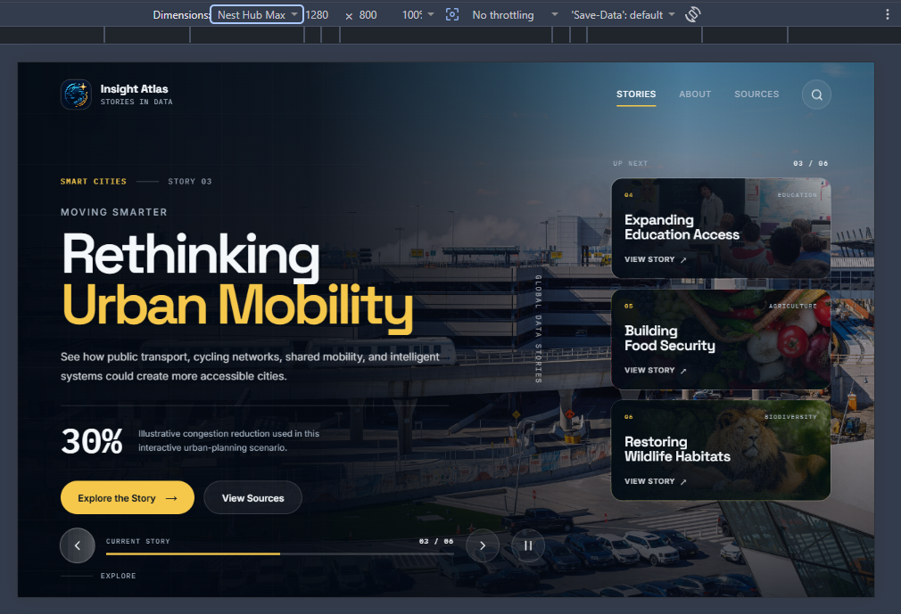
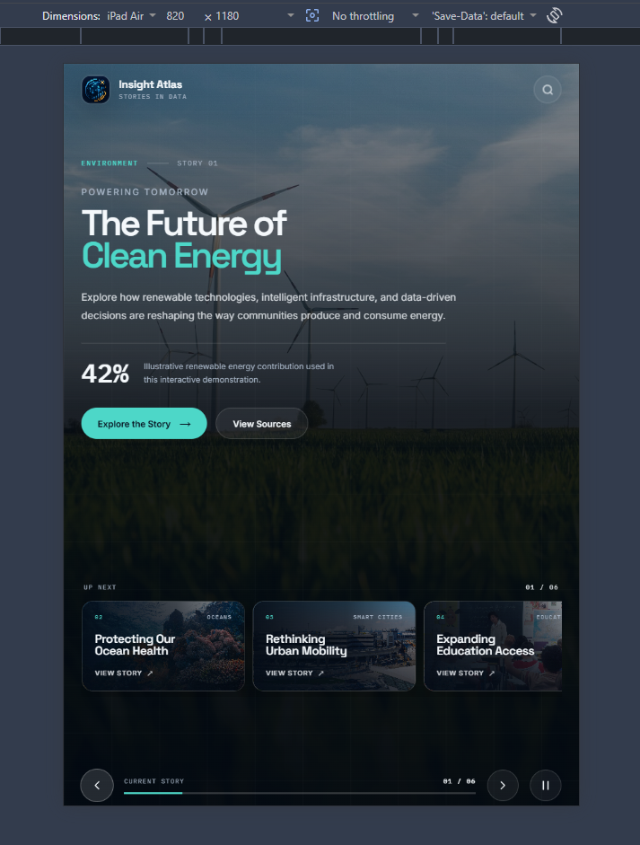
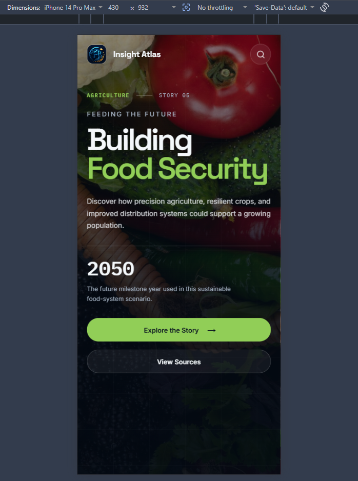

# Insight Atlas

### Interactive Global Data Stories

Insight Atlas is a responsive, interactive web experience that presents global topics through immersive visual storytelling.

It combines editorial-style design, full-screen imagery, structured story data, animated transitions, autoplay, keyboard interaction, and responsive layouts to create a polished data-storytelling interface.

---

## Project Preview


---

## Features

- Six dynamically rendered global data stories
- Previous and next story navigation
- Upcoming-story queue with direct story selection
- Five-second autoplay with pause/resume control
- GSAP-powered page reveal and story transitions
- Dynamic story progress indicator
- Keyboard navigation
- Reduced-motion support
- Story image preloading
- Fallback backgrounds for failed images
- Responsive desktop, tablet, and mobile layouts
- Custom project icon and favicon branding

---

## Technology Stack

| Technology | Version |
| --- | ---: |
| HTML5 | — |
| JavaScript | ES6+ |
| SCSS / Sass | 1.102.0 |
| GSAP | 3.15.0 |
| Vite | 8.2.1 |
| Node.js | 24.19.0 |
| npm | 11.17.0 |

**Development Tools:** Visual Studio Code, Git, GitHub

---

## Responsive Design

Insight Atlas adapts its storytelling experience across desktop, tablet, and mobile layouts while maintaining the visual identity and core interactions of the application.

### Desktop

The desktop layout presents the complete editorial experience with story content, navigation, progress tracking, and the upcoming-story queue visible simultaneously.



### Tablet

On tablet screens, the upcoming-story queue moves below the main content and becomes horizontally scrollable.

<p align="center">
  
</p>

### Mobile

The mobile layout simplifies the interface with responsive typography, stacked action buttons, and touch-friendly interactions.

<p align="center">
  
</p>

---

## Project Structure

```text
insight-atlas/
│
├── docs/
│   └── media/
│       ├── insight-atlas-demo.gif
│       ├── insight-atlas-desktop.png
│       ├── insight-atlas-tablet.png
│       └── insight-atlas-mobile.png
│
├── public/
│   ├── images/
│   ├── insight-atlas-icon.png
│   ├── favicon-32x32.png
│   ├── favicon-16x16.png
│   └── apple-touch-icon.png
│
├── src/
│   ├── styles/
│   │   ├── _variables.scss
│   │   ├── _base.scss
│   │   ├── _header.scss
│   │   ├── _hero.scss
│   │   ├── _cards.scss
│   │   ├── _controls.scss
│   │   └── main.scss
│   │
│   ├── utils/
│   │   └── preloadImages.js
│   │
│   ├── animations.js
│   ├── data.js
│   └── main.js
│
├── index.html
├── package.json
├── package-lock.json
└── README.md
```

---

## How It Works

Story content is maintained separately in `data.js` and rendered dynamically by `main.js`.

```text
Story Data
    ↓
main.js
    ├── Rendering
    ├── Navigation
    ├── Autoplay
    └── Progress
         ↓
animations.js
    └── GSAP transitions
```

Story images are preloaded before the initial page reveal to reduce visible flashing during transitions. Individual image failures are handled gracefully so that one failed asset does not prevent the application from loading.

---

## Design Inspiration

Insight Atlas began as an exploration of the general **"Timed Cards Opening"** interaction concept — combining featured visual content, upcoming cards, and automatic progression.

The concept was developed into an original global data-storytelling experience with its own:

- Visual identity and custom branding
- Editorial hero layout
- Global story content
- Upcoming-story queue
- Navigation and progress system
- Story-specific accent colours
- GSAP animation sequence
- Responsive behaviour
- Accessibility considerations

The final interface was built from scratch using HTML, JavaScript, SCSS, Vite, and GSAP.

---

## Controls

| Key / Control | Action |
| --- | --- |
| Previous button | Previous story |
| Next button | Next story |
| Queue card | Open selected story |
| `←` | Previous story |
| `→` | Next story |
| `Space` | Toggle autoplay where appropriate |

---

## Getting Started

### Clone the repository

```bash
git clone https://github.com/IsharaParanagamaGedara/insight-atlas
cd insight-atlas
```

### Install dependencies

```bash
npm install
```

### Start the development server

```bash
npm run dev
```

### Create a production build

```bash
npm run build
```

### Preview the production build

```bash
npm run preview
```

---

## Development Workflow

Insight Atlas was developed incrementally using feature branches that were merged into `develop` after completion and testing.

Completed feature branches were deleted after successful merges, leaving the long-lived branch structure:

```text
main
  │
  └── develop
```

The project was developed through five phases:

1. **Foundation** — Vite setup, SCSS architecture, header, and hero layout
2. **Story Engine** — structured story data, dynamic rendering, and story queue
3. **Interaction** — navigation, keyboard controls, and progress tracking
4. **Animations** — GSAP transitions, autoplay, and motion handling
5. **Polish** — accessibility, image preloading, responsive refinement, and branding

---

## Future Enhancements

- Dedicated full story pages
- Interactive charts and data visualizations
- Real data-source integration
- Story search and category filtering
- Touch/swipe navigation
- Story sharing
- Additional global data stories
- Production deployment

---

## Author

**Sulani Ishara**

Software Engineering Portfolio Project